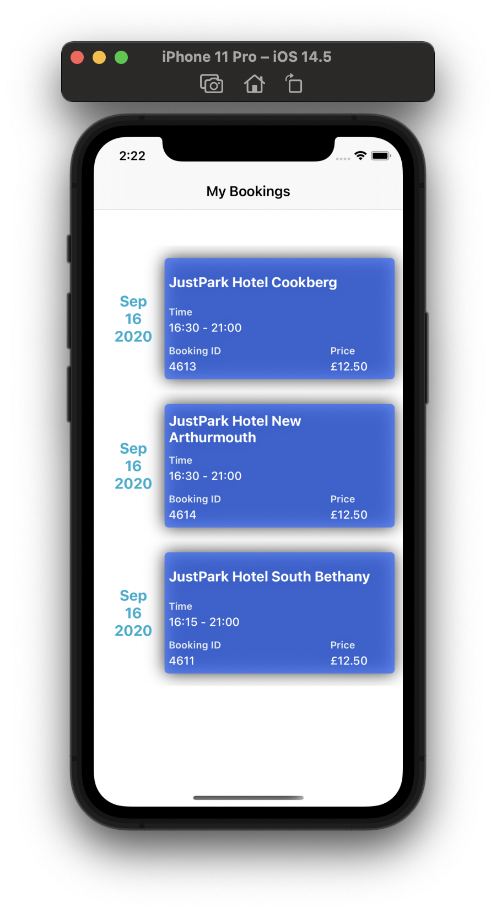
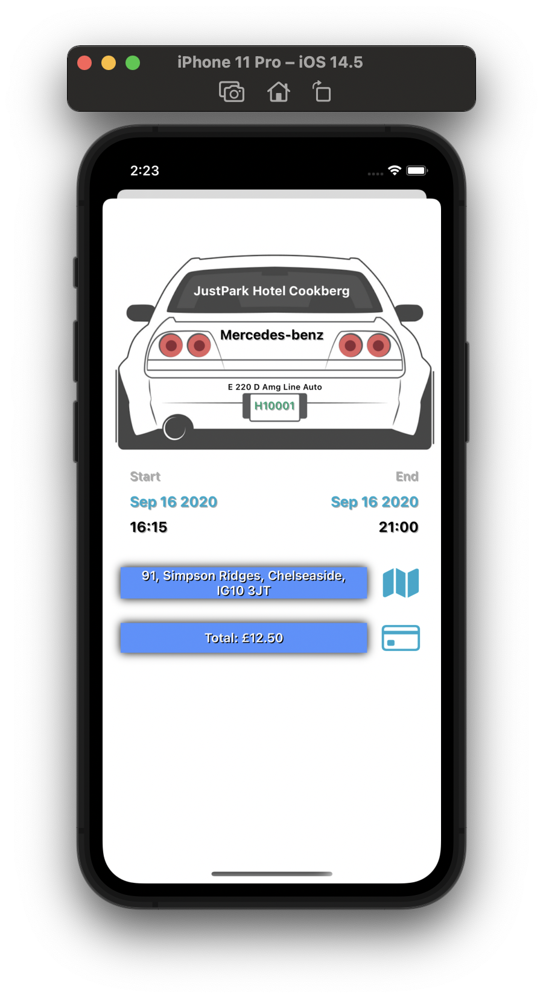

# JustPark iOS

## Table of contents
* [Introduction](#introduction)
* [Application Screens](#application-screens)
* [Features](#features)
* [Software And Technologies](#software-and-technologies)
* [Setup](#setup)
* [Approach](#approach)
* [Code Structure And Design Pattern](#code-structure-and-design-pattern)
* [Future Features And Improvements](#future-features-and-improvements)

## Introduction:
iOS application to fetch and display a list of Driver's Bookings from the given endpoint, built with a Swift, UIKit.

## Application Screens:

## Features:
1.  Consumption of API to fetch the booking listing. (URL Session, Codable)
2.  Create List view to display the booking list fetched from API. 
3.  Create Details screen to show the details of the selected Booking.
4.  Error handling throughout the application.

## Software And Technologies:
* MacOS: Big Sur (11.0.1)
* XCode: 12.5
* Minimum iOS version: 12.1
* Swift: 5.1
* UIKit

## Setup:
To run this project, open the TechnicalTaskApp.xcodeproj in XCode and you should be able to run it on the desired simulator without any changes(iPhone).
You will need to configure your development team in the app target's **"Signing & Capabilities"** tab in order to run it on real device.

## Approach:
1.  On the launch of the app, fetch the character list from API endpoint, using **URL Session** data task.
2.  Create the Booking Json object from API response data using **JSONDecoder**.
3.  Use **UIKit** components to show the Bookings in  a TableView.
4.  Allow user to select List item and show details of selected booking in new view controller.
5.  Show Errors using **Alert view** appropriately.
6.  **Protocols-Delegates**: Used protocols for notifying the controller about  data availability and errors if any.
7.  **Enum**: Used with **Tuple** cases, **generic** type for Success and Failure conditions.
8.  **Extensions**: Used for adding more functionality to class and modularizing the code.

## Code Structure And Design Pattern:

### View:
1.  **ListingsViewController** – view responsible for showing the booking list view.
2.  **BookingsCell** -  view responsible for creating the booking list view cell.
3.  **DetailsController** – view responsible for showing the selected booking details.

### Model:
1.  **Booking** – model used for the Booking list json data.
1.  **BookingDetails** – model used for the Booking Details  json data.

### Networking:
1.  **NetworkManager** - responsible for managing the network call to get the data from the API.
2.  **CharacterService** - responsible for managing the API service for booking list data.
3.  **ResponseDecoder** -  JSON decoder to parse and create the response model using JSONDecoder.
4.  **EndpointType** - protocol to get the base url and path components.
5.  **BookingAPI** - enum to specify API services available for Booking app.

### Utility:
1.  **Constants** – responsible for maintaining the constants used in app.
2.  **Types** - contains enum types used in app to specify https method type and APIs result(success/failure).

### Other:
1.  **ServiceDelegate** - protocol to notify when the data is available. (Notify Success or Failure)

## Future Features And Improvements:
1.  Write Unit Tests and UI test.
2.  Add more animations.
3.  Implement show on map functionality.
4.  Show more details from the API.

